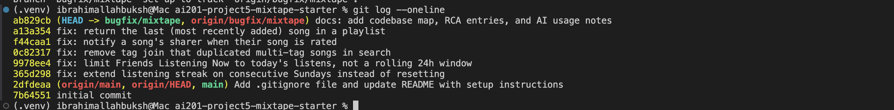

# Project 5: Mixtape Bug Hunt

Branch: `bugfix/mixtape`

## AI usage

I used Claude Code (Opus) throughout, mostly as a debugging partner. It summarized the service files and traced the route to service call chains so I could get oriented faster, and it wrote a small script that seeded an in memory database so I could reproduce each bug by calling the service functions directly instead of poking the API by hand.

The spot where I had to push back was Issue #3. The obvious answer (the tag join returns one row per tag, so songs duplicate) sounded right, but when I actually ran the search the song came back once, not three times. So I ran the query a few different ways and found that the old `query().all()` API quietly dedupes by primary key, which hides the problem. The join is still wrong, it just doesn't surface unless you use the newer `select()` API. I also ran every fix against the test suite rather than assuming it worked.

## Codebase map

Mixtape is a Flask and SQLAlchemy JSON API. No templates, every route returns JSON.

* `app.py`: app factory. Sets up the database and registers the four blueprints (`/songs`, `/playlists`, `/users`, `/feed`).
* `models.py`: 7 models (User, Tag, Song, ListeningEvent, Rating, Playlist, Notification) plus 3 join tables. Two things that matter for the bugs: ratings are their own table with a unique (user, song) constraint, and a song's spot in a playlist is an explicit `position` number, not insertion order.
* `routes/`: thin controllers. Each parses the request, calls one service function, returns JSON.
* `services/`: all the real logic and every database commit. All five bugs live here.
* `seed_data.py`: rebuilds the database with users, songs, playlists and events.
* `tests/`: pytest suites on in memory SQLite.

Pattern I noticed: routes never hold logic, they hand straight off to a service. So every bug was in a service file.

Data flow, rating a song: `POST /songs/<id>/rate` calls `rate()` in `routes/songs.py`, which calls `rate_song()` in `notification_service.py`. That saves or updates the `Rating` row, then (after my fix) notifies whoever shared the song. The sharer sees it later through `GET /users/<id>/notifications`.

## Root cause analysis

### Issue #1: streak resets on Sundays

**Reproduced.** Called `update_listening_streak` for a Saturday then a Sunday. Streak went 1 to 1 instead of 1 to 2. The existing Sunday test was already failing.
**Found it.** Followed the listen route into `streak_service.py`. The consecutive day branch had a weird weekday check.
**Root cause.** The increment branch was `elif days_since_last == 1 and today.weekday() != 6`. `weekday()` returns 6 for Sunday, so any Sunday listen skipped the increment and fell through to the reset. That weekday check had no reason to be there.
**Fix.** Removed the weekday check so it reads `elif days_since_last == 1`. The other streak tests (new user, same day, skipped day) still pass.

### Issue #2: feed shows people from yesterday

**Reproduced.** Gave a friend a listen from the night before and called `get_friends_listening_now`. They still showed up in the morning.
**Found it.** The cutoff line in `feed_service.py` and the `RECENT_THRESHOLD = 24 hours` constant it used.
**Root cause.** The cutoff was `now minus 24 hours`, a rolling window. At 9am that reaches back to 9am the previous day, so an 11pm listen from last night is still inside it. The feature is meant to show today only.
**Fix.** Set the cutoff to the start of the current day (midnight UTC) and dropped the unused constant. A listen at 00:30 today shows, one at 23:59 yesterday doesn't. Left `get_activity_feed` alone since it's supposed to ignore time.

### Issue #3: same song shows up more than once in search

**Reproduced.** The reported symptom didn't actually appear, the song came back once. So I reproduced the mechanism instead: ran the join three ways against a song with 3 tags. Raw join gave 3 rows, `select().scalars().all()` gave 3, but `query().all()` gave 1.
**Found it.** The `outerjoin(song_tags)` in `search_service.py`.
**Root cause.** The search joins to `song_tags` even though nothing filters on tags (tags load separately in `to_dict`). The join multiplies rows by tag count. It only looks fine because the old `query()` API dedupes by identity, so it is one refactor away from the reported bug.
**Fix.** Removed the join. Row counts drop from 3 to 1 under both APIs, results still include tags, and every search test passes.

### Issue #4: no notification when a song is rated

**Reproduced.** Rated someone's song, then checked their notifications. Nothing, even though the rating saved.
**Found it.** Both paths sit in `notification_service.py`. `add_to_playlist` ends with a `create_notification` call. `rate_song` had nothing like it.
**Root cause.** Notifications only happen when something explicitly calls `create_notification`, and `rate_song` never did. Nothing else fires on a rating.
**Fix.** After saving the rating, added the same notify block `add_to_playlist` uses, only when the rater isn't the sharer. Rating your own song still creates nothing, rating again still notifies, and the playlist path is untouched.

### Issue #5: last song in a playlist never shows

**Reproduced.** Built a playlist with 3 songs, `get_playlist_songs` returned 2. The existing playlist tests were failing.
**Found it.** The last line of `get_playlist_songs` in `playlist_service.py`.
**Root cause.** It returned `songs[:-1]`. The list is already sorted by position, so `[:-1]` drops the highest position, which is the most recently added song.
**Fix.** Removed the slice. Empty playlists still return an empty list and order is preserved.

## Tests

The existing suite already covers #1, #3 and #5. I added `tests/test_feed.py` for #2 (freezes the clock, checks last night is excluded and today is included) and `tests/test_notifications.py` for #4 (rating notifies the sharer, doesn't self notify, rating again still notifies). I confirmed both new files fail on the buggy code and pass on the fix. Whole suite: 18 passed.

Run with `python -m pytest -q`.

## One thing I found but didn't fix

`add_to_playlist` throws an IntegrityError when adding a genuinely new song, because the relationship append doesn't set the required `position` and `added_by` columns. It isn't one of the five issues so I left it, but it probably deserves its own ticket.

## Commits

